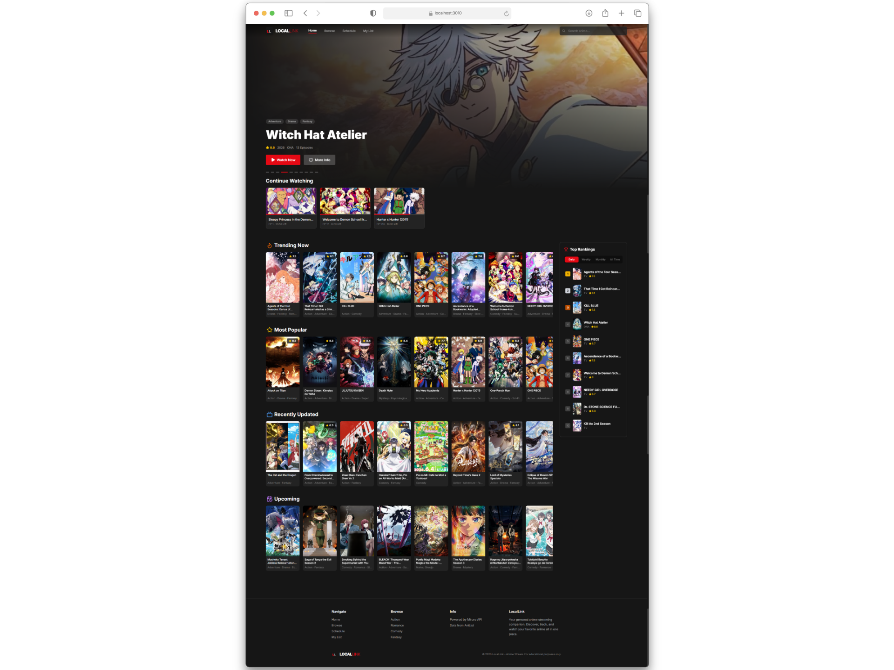
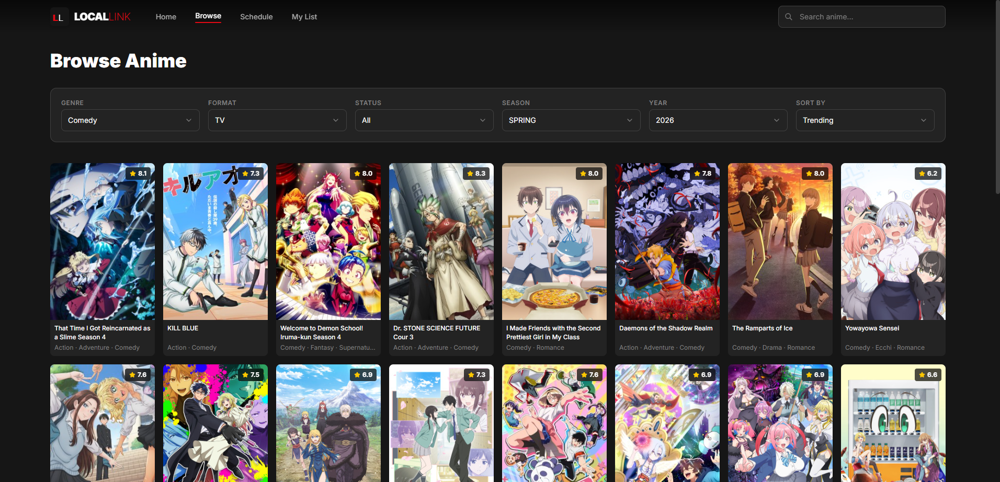
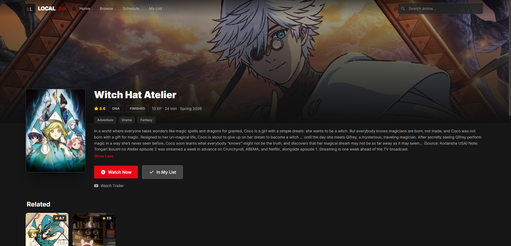
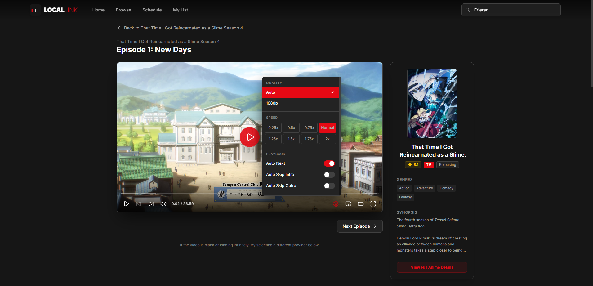
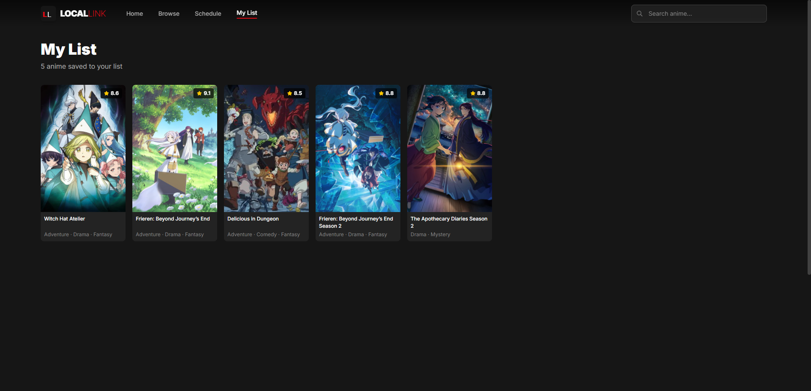
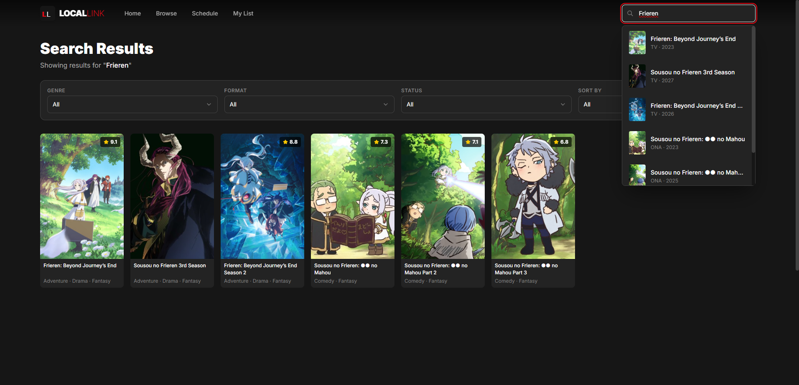
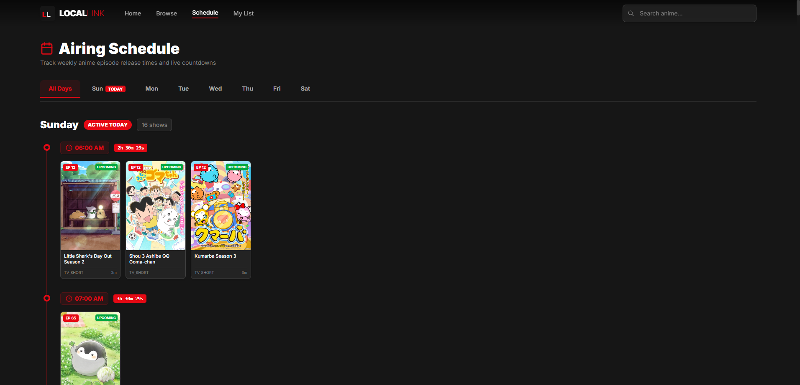

  

# LocalLink - Anime Streaming Platform

**Your modern, high-performance local platform for streaming and discovering anime.**

  

    
    
    
    
    
    
    
  

   

A fast, reliable, and beautifully designed streaming experience inspired by premium services like Netflix. LocalLink brings your favorite series right to your desktop with seamless playback and intuitive discovery features.

## 📸 Showcase

### Homepage Experience

  

### App Features

|                                  Discovery                                  |                                  Anime Details                                  |
| :-------------------------------------------------------------------------: | :-----------------------------------------------------------------------------: |
|  |  |
|                              **Video Player**                               |                                **User Library**                                 |
|  |   |

 

  
<b>🔍 Click to view Search Interface</b>

   
  

    
  

  
<b>🗓️ Click to view full Airing Schedule</b>

   
  

    
  

## 🔗 Links

- **Changelog**: [View Changelog](./CHANGELOG.md)
- **Releases**: [Download & Release Notes](https://github.com/Soujiro0/locallink-anime-stream/releases)
- **API Docs**: [View API Documentation](./docs/API_DOCUMENTATION.md)
- **Setup Docs**: [View Setup Documentation](./docs/SETUP_DOCUMENTATION.md)

## 🛠 Tech Stack & Architecture

- **Frontend**: React, Tailwind CSS v4, Vite, HLS.js
- **Backend**: Node.js, Express (MVC Architecture: modular controllers, routes, and utilities in `src/`), pkg (Executable Bundling)

## 🐛 Issue Tracking

Found a bug or have a feature request? Please check the [Issues](https://github.com/Soujiro0/locallink-anime-stream/issues) tab to see if it has already been reported, or open a new issue.

## 📄 License

This project is licensed under the [MIT License](./LICENSE).
